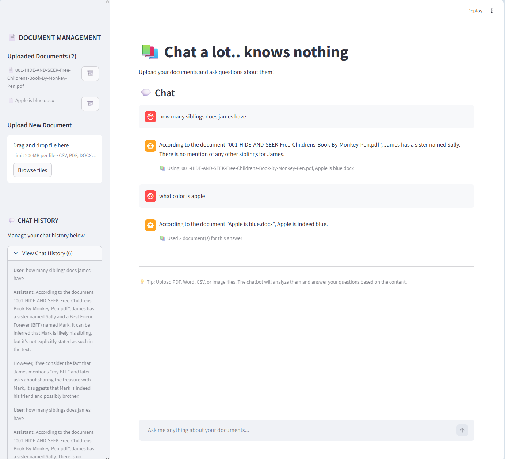
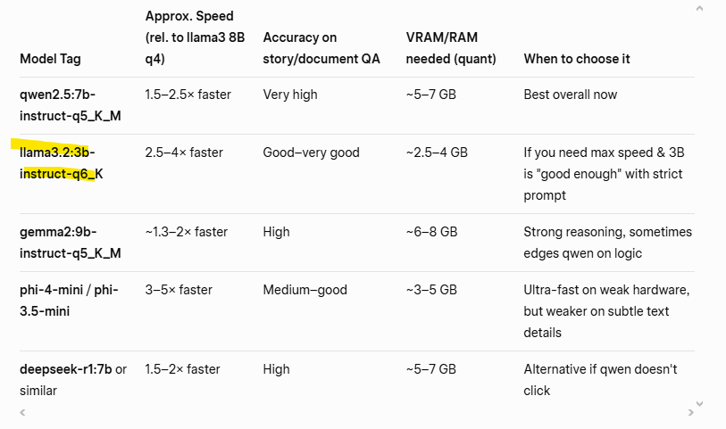

# Chat-a-Lot Knows Nothing

## Problem Statement

As a software engineer I spend hours in documentation, yet I still forget basic terms — either due to information overload or because I'm just ramping up on the business context.

I don't want to hunt through hundreds of pages just to answer simple questions like:

> “What font should this text use?”

I’d rather get fast, trustworthy answers so I can focus on the engineering work that actually drives progress.

## My Solution
A chatbot that:

- Supports uploading your business documents (PDFs, docs, etc.)
- Grounds every answer exclusively in those files via secure RAG
- Ensures full privacy: 100% offline, no cloud, no data sharing
- Answers straightforward questions in seconds
- Forgets everything when you want—no unwanted memory



### Processing Pipeline
1. User uploads document via Streamlit → saved locally  
2. Text extracted from PDF/Word/etc.  
3. Extracted text sent to local Ollama for AI processing  

## Architecture
- **UI**  
  Streamlit

- **Orchestration Layer**  
  Django + LangGraph

- **Data & Knowledge Base**  
  SqlLite / ChromaDB (vector) - Upcoming! 

- **Model & Integration Layer**  
  Ollama 

- **Deployment**  
  [to be specified]

- **Hosting**  
  [to be specified]

## Upcoming Improvements
To improve Ollama processing time:
Migrate from SqlLite to ChromaDB for vector storage and retrieval.  
Key change: Avoid chunking and embedding every uploaded document upfront. Instead, identify and retrieve only the single most relevant full document matching the user's query, then send its entire unchunked content directly to Ollama for context and processing.

## Setup & Installation

### Option 1: Local Development

#### Prerequisites
- Python 3.12+
- pip/venv
- Docker

#### Steps

1. **Clone the repository:**
   ```bash
   git clone https://github.com/joey-peh/chat_a_lot_knows_nothing.git
   cd chat_a_lot_knows_nothing
   ```

2. **Create virtual environment:**
   ```bash
   python -m venv .venv
   source .venv/bin/activate  # On Windows: .venv\Scripts\activate
   ```

3. **Install dependencies:**
   ```bash
   # Backend
   cd backend
   pip install -r requirements.txt
   
   # Frontend
   cd ../frontend
   pip install -r requirements.txt
   cd ..
   ```

4. **Setup database:**
   ```bash
   cd backend
   python manage.py migrate
   cd ..
   ```

5. **Run services:**
   
   **Terminal 1 - Backend:**
   ```bash
   cd backend
   python manage.py runserver 0.0.0.0:8000
   ```
   
   **Terminal 2 - Frontend:**
   ```bash
   cd frontend
   streamlit run app.py
   ```

   **Terminal 3 - Ollama:**
   ```bash
   # Run Ollama container
   docker run -d -v ollama:/root/.ollama -p 11434:11434 --name ollama ollama/ollama

   # Pull the Llama 3.2 model
   docker exec ollama ollama pull llama3.2:3b-instruct-q6_K

   # Test the model
   docker exec -it ollama ollama run llama3.2:3b-instruct-q6_K
   ```

6. **Access the application:**
   - Frontend: http://localhost:8501
   - Backend API: http://localhost:8000   
   - Ollama API: http://localhost:11434

### Option 2: Docker (Recommended)

#### Prerequisites
- Docker
- Docker Compose

#### Steps

1. **Clone the repository:**
   ```bash
   git clone https://github.com/joey-peh/chat_a_lot_knows_nothing.git
   cd chat_a_lot_knows_nothing
   ```

2. **Build and run containers:**
   ```bash
   docker-compose up --build
   ```
   
   Or run in background:
   ```bash
   docker-compose up -d --build
   ```

3. **Pull the Llama 3.2 model**
   ```bash
   docker exec ollama_service ollama pull llama3.2:3b-instruct-q6_K
   ```

3. **Access the application:**
   - Frontend: http://localhost:8501
   - Backend API: http://localhost:8000
   - Ollama API: http://localhost:11434

4. **Useful Docker commands:**
   ```bash
   # View logs
   docker-compose logs -f
   
   # Stop containers
   docker-compose down
   
   # Run migrations
   docker-compose exec backend python manage.py migrate
   
   # Create superuser
   docker-compose exec backend python manage.py createsuperuser
   ```

For more Docker details, see [DOCKER_SETUP.md](DOCKER_SETUP.md)

## API Endpoints

- `POST /api/chats/` - Send a message to the chatbot
- `POST /api/documents/` - Upload a document for processing

## Model Options
 (Thanks Grok!)